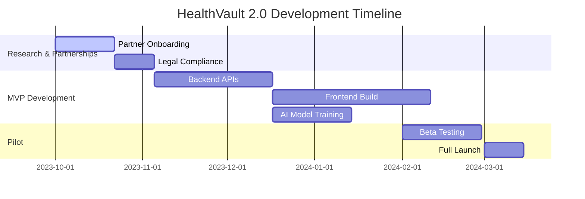

# HealthVault 2.0 Implementation Plan

## Overview
HealthVault is a centralized platform for managing medical records, appointments, prescriptions, and more. New features include **telemedicine, AI symptom checks, pharmacy integration, and wearable device sync**.

---

## Enhanced Features
### 1. **Appointment Booking**
   - **Doctor Discovery**: Search specialists by location, rating, or insurance.
   - **Calendar Sync**: Integrate with Google/Apple calendars for reminders.
   - **Video Consultations**: Built-in telemedicine with Zoom/WebRTC.
   - **Prescription Renewals**: Auto-request refills during bookings.

### 2. **Medicine Purchasing**
   - **E-Pharmacy Integration**: Partner with PharmEasy, 1mg, or local pharmacies.
   - **Price Comparison**: Compare costs across vendors.
   - **Prescription OCR**: Scan and validate prescriptions before ordering.
   - **Delivery Tracking**: Real-time updates via SMS/push.

### 3. **AI-Powered Tools**
   - **Symptom Checker**: Chatbot using ChatGPT/Med-PaLM for preliminary advice.
   - **Drug Interaction Alerts**: Flag conflicts between medications.
   - **Health Insights**: Predict trends (e.g., blood sugar spikes) via wearable data.

### 4. **Wearable Integration**
   - Sync with Fitbit, Apple Health, or Dexcom for real-time vitals (heart rate, glucose).
   - Generate reports for doctors.

### 5. **Emergency Services**
   - **SOS Button**: Share location/records with emergency contacts.
   - **Nearest Hospital Finder**: GPS-based directory with ICU bed availability.

### 6. **Community & Education**
   - **Health Forums**: User discussions moderated by doctors.
   - **Article Library**: Curated content on nutrition, mental health, etc.

---

## Updated Tech Stack
| Component               | Tools/Technologies                                                                 |
|-------------------------|------------------------------------------------------------------------------------|
| **Frontend**            | React Native, Redux, Video.js (telemedicine)                                      |
| **Backend**             | Node.js/Express.js, Python (AI models)                                            |
| **Database**            | PostgreSQL + MongoDB + Firebase Storage                                          |
| **APIs**                | Google Maps (hospital finder), Stripe (payments), Twilio (SMS)                   |
| **AI/ML**               | TensorFlow (predictive analytics), OpenAI API (symptom checker)                  |
| **Wearables**           | Apple HealthKit, Google Fit API                                                  |
| **Security**            | HIPAA-compliant servers, biometric authentication                               |

---

## Implementation Phases (Revised)

### Phase 1: Research & Partnerships (6 Weeks)
- Partner with pharmacies, hospitals, and wearable brands.
- Legal compliance for telemedicine and e-prescriptions.

### Phase 2: MVP + New Features (18 Weeks)
- **Backend (6 Weeks)**
  - Appointment booking APIs, payment gateway, telemedicine setup.
  - AI model training (symptom checker).
- **Frontend (8 Weeks)**
  - Pharmacy UI, telemedicine screens, wearable dashboard.
  - SOS button and emergency features.
- **Testing (4 Weeks)**
  - End-to-end testing for prescriptions and video calls.

### Phase 3: Pilot Launch (6 Weeks)
- Test with 1,000 users and 50 partner clinics.
- Optimize AI accuracy based on feedback.

### Phase 4: Full Launch & Scale (Ongoing)
- **Marketing**: Collaborate with influencers and healthcare NGOs.
- **Monetization**: 
  - Freemium model: Charge for AI insights and premium support.
  - Commission from pharmacy partners.

---

## Timeline

---

## Challenges & Mitigation
1. **Regulatory Hurdles**  
   - Hire legal advisors for telemedicine compliance in target regions.  
2. **AI Accuracy**  
   - Train models on WHO/CDC datasets to reduce misinformation.  
3. **Pharmacy Logistics**  
   - Start with metro cities and scale gradually.  

---

## Post-Launch Roadmap
- **Phase 5**: Integrate insurance claims processing.
- **Phase 6**: Mental health support with licensed therapists.
- **Phase 7**: Global expansion (EU/USA).

---

## Conclusion
HealthVault 2.0 transforms passive record storage into an active healthcare ecosystem. Prioritize partnerships and AI refinement to build trust and utility.